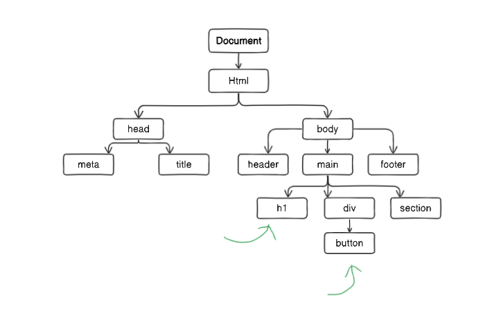
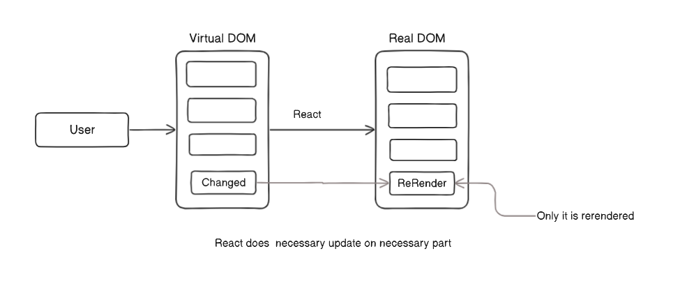
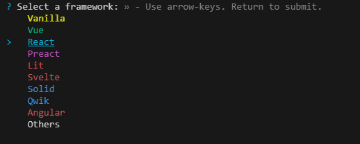
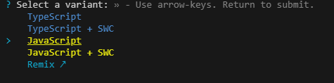
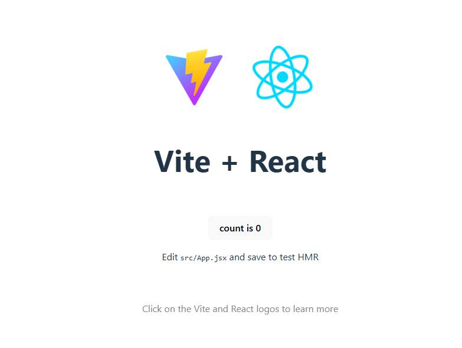
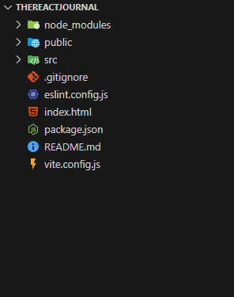
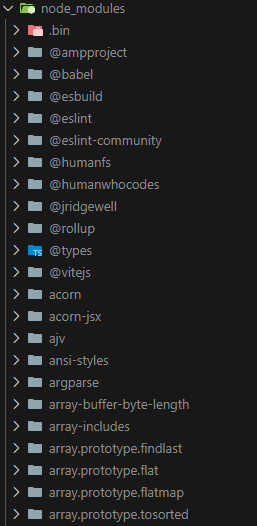
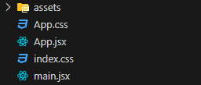
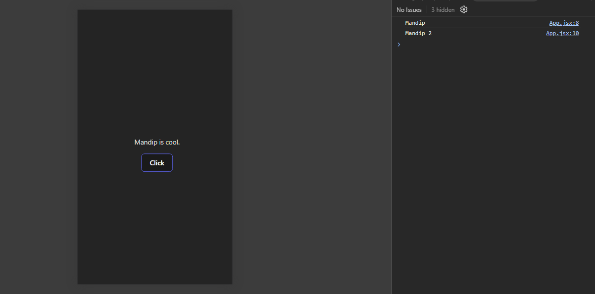

# TheReactJournal - Intro
A goto react journal to view react Notes.

---
---

# Introduction part 

## Dom Tree
Dom stands for document object model where the elements in your html are rendered as objects . And dom tree is a visual example of it where each node represents a object (or an element) . 

Now we know dom , let us take this example of a dom tree :



In this dom tree structure if we want to change something on h1 on click of button then the whole document , or all dom tree gets rerendered.

This creates serious issues for application performance . To solve the issue , the team at facebook developed react.

### What happens in react
What happens when we use react is that for the same example above , on click of a button the whole page doesnt rerenders . Only the h1 gets rerendered which ends up saving a lot of time.

## What is React
React js is a library . Its added with react-dom , or react-native or nextjs creates a complete framework capable of making mobile app or web apps.

## Virtual DOM
React works on principal of virtual dom.
What happens in react is it creates a copy of real dom . Once a change is made it happens in virtual dom . Then the virtual dom is compared to real dom and only the part where change gets changed in real dom . It makes web experiences way better.

 

This makes the task efficient and faster.

---
---

# Using react with cdn

```
Not common practice ,  but definitelt possible.
```

We can use react over cdn by adding these code in our script too :

---
**Html file**
```html
<!DOCTYPE html>
<html lang="en">
<head>
    <meta charset="UTF-8">
    <meta name="viewport" content="width=device-width, initial-scale=1.0">
    <title>Document</title>
</head>
<body>
    <div id="root">

    </div>
    <!-- Development cdns  -->
    <script crossorigin src="https://unpkg.com/react@18/umd/react.development.js"></script>
    <script crossorigin src="https://unpkg.com/react-dom@18/umd/react-dom.development.js"></script>

    <!-- Production cdns  -->
    <!-- <script crossorigin src="https://unpkg.com/react@18/umd/react.production.min.js"></script>
    <script crossorigin src="https://unpkg.com/react-dom@18/umd/react-dom.production.min.js"></script> -->

    <!-- Our js -->
     <script src="./script.js"></script>
</body>
</html>
```

---
**Our js file**
```js
// React and ReactDOM are coming from react.


var h1 = React.createElement('h1' , null , "Hello from react");
// We are adding no attributes for now in h1.
var root = document.querySelector("#root");

// Create a h1 element inside react dom 
var root = ReactDOM.createRoot(root);
root.render(h1);

```


---
---

# Creating a proper react app

There are two popular ways to create a proper folder structure for react . They are :

1. Using `create-react-app`
2. Using `vite`

Nowadays create-react-app , also known as `CRA` is not used because it is slow . 

Instead we use vite to create a react app .

## Vite vs Cra

``A ton of reasons in case you need.``


| Feature                        | **Vite**                                   | **Create React App (CRA)**               |
|--------------------------------|--------------------------------------------|------------------------------------------|
| **Performance**                | Lightning-fast due to native ES modules and HMR. | Slower, especially in development mode.  |
| **Setup Time**                 | Very fast setup.                          | Comparatively slower setup.              |
| **Bundle Size**                | Produces smaller, optimized bundles.      | Larger bundles without manual optimization. |
| **Development Speed**          | Extremely fast HMR (Hot Module Replacement). | HMR is slower and less efficient.        |
| **Build Tool**                 | Uses modern tools like ESBuild and Rollup. | Uses Webpack, which can be slower.       |
| **Customization**              | Highly customizable.                      | Limited customization without ejecting.  |
| **Plugin Support**             | Wide plugin support for various tools.    | Limited, needs manual setup for plugins. |
| **Typescript Support**         | Built-in, very seamless.                  | Supported, but requires manual setup.    |
| **Ecosystem**                  | Newer but growing rapidly.                | Established with a large user base.      |
| **Learning Curve**             | Easy to start but may require understanding Vite's configurations. | Very beginner-friendly.                  |
| **Future Proofing**            | Built for modern web standards.           | Uses older tooling, less future-proof.   |
| **Community Support**          | Smaller but active and growing.           | Large and well-established.              |
| **Project Complexity**         | Ideal for simple to medium projects.      | Can handle larger projects but may require ejecting for advanced use cases. |
| **SSR (Server-Side Rendering)**| Built-in support with Vite SSR.           | Requires additional tools or libraries.  |
| **Initial Configuration**      | Minimal, works out of the box.            | Ready out of the box but less optimized. |


## Using cra to make a react app
```bash
npm create-react-app myapp
```

## Using vite to create a vite app.

### 1. Type this in terminal.
```bash
npm create vite@latest
```

### 2. Give a project name


### 3. Select react with arrow keys and press enter



### 4. Select you need ts or not


In this I will use pure js for now.

### 5. Go to the directory and run npm install
```bash
cd app-name
```

```bash
npm install
```

### 6. Run the app
```bash
npm run dev
```

This is how the app will look :


---
---


# Understanding Folder Structure

In both vite and cra we can see similar structure but there is a difference too.

## Vite folder Structure

In vite we can see this kind of structure .



Lets understand each 1 by 1.

### 1. node_modules
It has all the require code to run react . Instead of using from cdn its now stored in our device . Dont get scared when we open the folder . It contains all modules used by react.



### 2. public
It contains all public assets like favicon and images.

### 3. src
It is whats the main part . We write all our code here . 
Inside src we have a bit more . Here is how it looks .
<!-- // Todo a lot  -->
 

Lets demystify this one by one too.

But first lets know what .jsx means.

#### A. Understanding jsx


#### 1. main.jsx
// Explaination
```jsx
import { StrictMode } from 'react' // Using strict react to reduce error
import { createRoot } from 'react-dom/client'
import './index.css'
import App from './App.jsx'

createRoot(document.getElementById('root')).render(
  <StrictMode>
    <App />
  </StrictMode>,
) // Adding elements in root with help of react

```

#### 2. index.css
```css
 /* Here is where all styling goes  */
```

#### 3. App.jsx

There is a more amount of code using some react features but for now this is how a App.jsx page should be.

```jsx
import './App.css'

function App() {

  return (
    <>
      <div>
        <p>My app</p>
      </div>
    </>
  )
}

export default App

```

#### 4. App.css
```css
/* Another css page */
```

#### 5. assets
---

### 4. .gitignore
It has a instruction on all the files git has to ignore.

### 5. index.html
It contains a html file with a root element . Similar to how h1 was created inside root using js previously here , every code we write will be inside this root div.
```html
<!doctype html>
<html lang="en">
  <head>
    <meta charset="UTF-8" />
    <link rel="icon" type="image/svg+xml" href="/vite.svg" />
    <meta name="viewport" content="width=device-width, initial-scale=1.0" />
    <title>Vite + React</title>
  </head>
  <body>
    <div id="root"></div>
    <script type="module" src="/src/main.jsx"></script>
  </body>
</html>

```

### 6. package-lock.json

### 7. package.json

### 8. README.md
This contains the documentation and summary of what the app is all about . Well , you are reading one right now.

### 9. vite.config.js

## CRA Folder Structure

# React and VSCode setup

For easier react experience , these extensins help a lot.

# React a bit theory part.

When using strictmode we can see code being executed twice.

## Jsx
Jsx means the combination of javascript and react.

# Take a look at this code 

```jsx
import './App.css'

function App() {

  let name = "Mandip";

  const click = ()=>{
    console.log(name) ;
    name = "Mandip 2";
    console.log(name) ;
  }

  return (
    <>
      <div>
        <p>{name} is cool.</p>
        <button onClick={click}>Click</button>
      </div>
    </>
  )
}

export default App

```

In this code the value of name changes but is not rendered . 


---

You may think we can use this approach , right ?

But this is problematic.

 UI does updates when you click, but that's because you're directly changing the DOM with `document.querySelector("span").innerHTML = name;`. This skips React's system for updating the UI, which can cause issues later.

Here’s why this is not ideal:
1. **React Manages the DOM**: React is designed to automatically update the UI when state changes. By manually changing the DOM, you are bypassing this feature.
2. **Risk of Bugs**: In more complex applications, React might overwrite the manual DOM changes, causing unexpected behavior.
3. **Best Practice**: In React, it's better to use `useState` to handle changes. This ensures React knows when to re-render and update the UI correctly.

So, while it works now, using `useState` is the proper way to manage state in React. It is one of the hooks in react.


